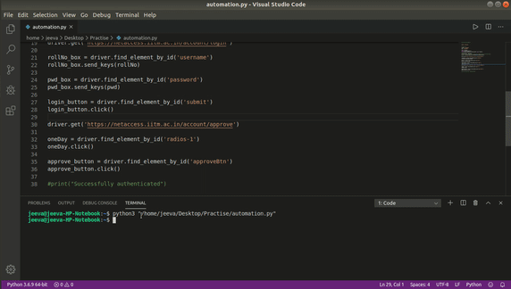

# Net-Access
Automate approving in https://netaccess.iitm.ac.in/ every 24 hours

# Stuffs required

Python and pip  
Selenium (pip install selenium)  
Chrome driver (http://chromedriver.chromium.org/downloads)  
 
Place the chrome driver in /usr/bin for linux (or) C:\Windows for Windows.

# Scheduling

Schedule the python code to run for every day using crontab for linux (or) Task Scheduler for Windows.

# Demo

